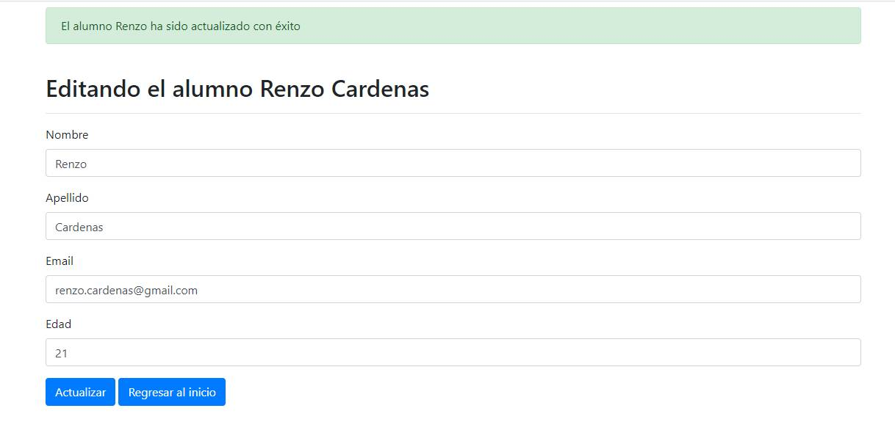

# CRUD STUDENTS APPLICATION WITH PHP, MYSQL, BOOTSTRAP, PDO.

How to create a CRUD application of students with PHP, MYSQL, BOOTSTRAP & PDO.

## STACK TECH :wrench: :hammer:

* PHP
* MySql
* Bootstrap
* PDO

# SCREENSHOT

